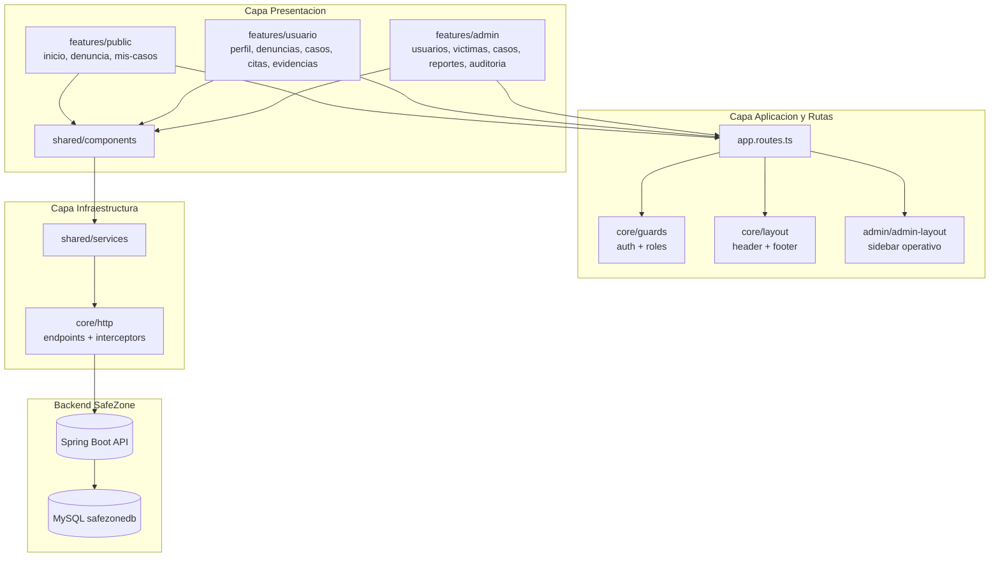

# SafeZone Frontend

## 1. Descripcion del proyecto
Aplicacion frontend construida con Angular para el sistema SafeZone: Plataforma Web de Denuncias.

Este repositorio contiene la base frontend para:
- autenticacion de usuarios por rol,
- portal publico y portal de usuario/victima,
- panel administrativo y operativo,
- estructura por funcionalidades,
- componentes y servicios compartidos,
- futura integracion con el backend SafeZone.

## 2. Objetivo del frontend
Proveer la interfaz web del sistema SafeZone para registrar denuncias, consultar casos, gestionar atenciones y administrar la operacion interna segun los roles definidos en los requerimientos.

SafeZone esta orientado a una atencion asistida: la victima puede reportar y consultar informacion autorizada, mientras que el personal responsable registra, clasifica, asigna y da seguimiento formal a los casos.

## 2.1 Estado de implementacion
- Proyecto Angular inicializado.
- Rama de trabajo: `dev`.
- Estructura base de carpetas creada por modulo.
- Archivos placeholder creados para pages, layouts, rutas, servicios y utilidades.
- Rutas, componentes funcionales, servicios HTTP e integracion real con backend pendientes de implementacion.

## 3. Arquitectura y stack
| Stack | Uso en el proyecto |
|---|---|
| Angular 21 | Framework principal SPA. |
| TypeScript | Lenguaje base del proyecto. |
| Angular Router | Definicion futura de rutas publicas, usuario y admin. |
| RxJS | Manejo futuro de flujos reactivos en servicios/componentes. |
| Vitest (`ng test`) | Pruebas unitarias. |
| Prettier | Formateo de codigo. |
| jsdom | Environment para pruebas en navegador. |

## 4. Dependencias principales
Dependencias declaradas en `package.json`:

**Dependencias de produccion:**
- `@angular/common` v21.2.0
- `@angular/compiler` v21.2.0
- `@angular/core` v21.2.0
- `@angular/forms` v21.2.0
- `@angular/platform-browser` v21.2.0
- `@angular/router` v21.2.0
- `rxjs` v7.8.0
- `tslib` v2.3.0

**Dependencias de desarrollo:**
- `@angular/build` v21.2.8
- `@angular/cli` v21.2.8
- `@angular/compiler-cli` v21.2.0
- `typescript` v5.9.2
- `vitest` v4.0.8
- `prettier` v3.8.1
- `jsdom` v28.0.0

## 5. Estructura del proyecto
```text
safeZoneFrontend/
├── src/
│   ├── app/
│   │   ├── core/
│   │   │   ├── guards/
│   │   │   ├── http/
│   │   │   └── layout/
│   │   ├── features/
│   │   │   ├── auth/
│   │   │   │   └── login/
│   │   │   ├── public/
│   │   │   │   ├── inicio/
│   │   │   │   ├── denuncia/
│   │   │   │   └── mis-casos/
│   │   │   ├── usuario/
│   │   │   │   ├── usuario-layout/
│   │   │   │   ├── usuario-dashboard/
│   │   │   │   ├── perfil/
│   │   │   │   ├── denuncias/
│   │   │   │   ├── casos/
│   │   │   │   ├── citas/
│   │   │   │   ├── evidencias/
│   │   │   │   └── notificaciones/
│   │   │   └── admin/
│   │   │       ├── admin-layout/
│   │   │       ├── admin-dashboard/
│   │   │       ├── usuarios/
│   │   │       ├── victimas/
│   │   │       ├── casos/
│   │   │       ├── asignaciones/
│   │   │       ├── citas/
│   │   │       ├── evidencias/
│   │   │       ├── reportes/
│   │   │       ├── notificaciones/
│   │   │       ├── auditoria/
│   │   │       └── configuracion/
│   │   ├── shared/
│   │   │   ├── components/
│   │   │   ├── services/
│   │   │   └── utils/
│   │   ├── app.routes.ts
│   │   └── app.config.ts
│   └── styles.css
├── angular.json
├── package.json
└── README.md
```

## 6. Modulos previstos
Los modulos se definieron a partir de los requerimientos funcionales del proyecto.

### Autenticacion y seguridad
- RF-01: Autenticar usuario.
- RF-02: Administrar roles de usuarios.
- RF-10: Configuracion de seguridad.
- RF-18: Panel principal por rol.
- RF-20: Auditoria de acciones.

### Usuario / Victima
Portal orientado al usuario final. Debe usar header y footer, sin sidebar.
- Perfil y contacto seguro.
- Denuncias asociadas.
- Casos asociados.
- Citas.
- Evidencias.
- Notificaciones.
- Historial de atencion.

### Administracion y operacion interna
Panel orientado al personal autorizado y administradores. Puede usar layout con sidebar.
- Usuarios y roles.
- Victimas.
- Casos y denuncias.
- Asignaciones de profesionales.
- Citas y atencion.
- Evidencias.
- Reportes.
- Notificaciones.
- Auditoria.
- Configuracion.

## 7. Roles del sistema
Roles definidos por los requerimientos y la base de datos:

| Rol | Enfoque principal |
|---|---|
| `VICTIMA` | Reportar, consultar denuncias/casos, revisar citas, evidencias y notificaciones permitidas. |
| `RECEPCIONISTA` | Registrar victimas, registrar denuncia asistida, clasificar casos y derivar atencion. |
| `PSICOLOGO` | Revisar casos asignados, registrar observaciones y confirmar atenciones psicologicas. |
| `DEFENSOR` | Revisar casos asignados, registrar acciones legales y confirmar atenciones legales. |
| `SOPORTE` | Apoyar operacion, trazabilidad y mantenimiento funcional del sistema. |
| `ADMIN` | Administrar usuarios, roles, seguridad, configuracion, reportes y auditoria. |

## 8. Rutas previstas
Actualmente las rutas no estan conectadas. La estructura prevista es:

### Rutas publicas:
- `/inicio` - Pagina inicial.
- `/login` - Inicio de sesion.
- `/denuncia` - Registro o inicio de denuncia.

### Rutas de usuario/victima:
- `/usuario` - Dashboard de usuario.
- `/usuario/perfil` - Perfil y datos de contacto.
- `/usuario/denuncias` - Denuncias asociadas.
- `/usuario/casos` - Casos asociados.
- `/usuario/citas` - Citas programadas.
- `/usuario/evidencias` - Evidencias asociadas.
- `/usuario/notificaciones` - Notificaciones del usuario.

### Rutas administrativas/operativas:
- `/admin` - Dashboard administrativo.
- `/admin/usuarios` - Gestion de usuarios y roles.
- `/admin/victimas` - Gestion de victimas.
- `/admin/casos` - Gestion de casos y denuncias.
- `/admin/asignaciones` - Asignacion de profesionales.
- `/admin/citas` - Gestion de citas.
- `/admin/evidencias` - Evidencias digitales.
- `/admin/reportes` - Reportes y estadistica.
- `/admin/notificaciones` - Notificaciones.
- `/admin/auditoria` - Auditoria de acciones.
- `/admin/configuracion` - Configuracion de seguridad.

## 9. Capa core
La carpeta `src/app/core/` queda reservada para elementos transversales:

- `guards/` - Guards de autenticacion y autorizacion por rol.
- `http/` - Endpoints, interceptors y configuracion HTTP.
- `layout/` - Layout publico con header y footer.

## 10. Capa shared
La carpeta `src/app/shared/` queda reservada para recursos reutilizables:

- `components/` - Componentes comunes como modales, spinners, tablas o alertas.
- `services/` - Servicios compartidos como toast, loading o helpers de sesion.
- `utils/` - Funciones utilitarias comunes.

## 11. Integracion futura con backend
El frontend debera integrarse con el backend SafeZone, desarrollado con Spring Boot y MySQL.

Modulos esperados de integracion:
- autenticacion,
- usuarios,
- victimas,
- denuncias,
- casos,
- asignaciones,
- citas,
- seguimientos,
- evidencias,
- notificaciones,
- auditoria,
- configuracion,
- reportes.

## 12. Seguridad y acceso
La seguridad se definira con control de acceso por roles.

Flujo esperado:
1. Usuario ingresa credenciales en `/login`.
2. Backend valida credenciales.
3. Frontend almacena la sesion o token.
4. Guards validan autenticacion y rol.
5. Interceptors agregan credenciales a peticiones HTTP.
6. Si la sesion expira, se redirige a `/login`.

## 13. Ejecucion local
Instalar dependencias:
```bash
npm install
```

Levantar aplicacion:
```bash
npm run start
```

Aplicacion local:
```text
http://localhost:4200
```

Build:
```bash
npm run build
```

Tests:
```bash
npm run test
```

## 14. Diagrama de arquitectura por capas (frontend)


## 15. Proteccion de rutas prevista
```text
PUBLICO
  |
  +-- /inicio
  +-- /login
  +-- /denuncia

USUARIO AUTENTICADO
  |
  +-- authGuard
      |
      +-- /usuario
      +-- /usuario/perfil
      +-- /usuario/denuncias
      +-- /usuario/casos
      +-- /usuario/citas
      +-- /usuario/evidencias
      +-- /usuario/notificaciones

PERSONAL AUTORIZADO / ADMIN
  |
  +-- authGuard
      |
      +-- roleGuard
          |
          +-- /admin
          +-- /admin/usuarios
          +-- /admin/victimas
          +-- /admin/casos
          +-- /admin/asignaciones
          +-- /admin/citas
          +-- /admin/evidencias
          +-- /admin/reportes
          +-- /admin/notificaciones
          +-- /admin/auditoria
          +-- /admin/configuracion
```

## 16. Nota de alcance
Este README documenta unicamente el frontend.

Estado actual:
- La estructura esta preparada.
- Los archivos creados en `core`, `features` y `shared` son placeholders.
- La logica funcional, rutas reales, servicios HTTP y estilos finales se implementaran en fases posteriores.
